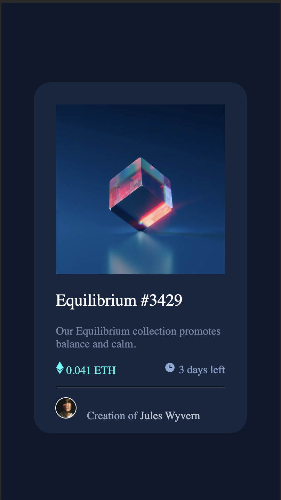

# Frontend Mentor - NFT preview card component solution

This is a solution to the [NFT preview card component challenge on Frontend Mentor](https://www.frontendmentor.io/challenges/nft-preview-card-component-SbdUL_w0U). Frontend Mentor challenges help you improve your coding skills by building realistic projects. 

## Table of contents

- [Overview](#overview)
  - [The challenge](#the-challenge)
  - [Screenshot](#screenshot)
  - [Links](#links)
- [My process](#my-process)
  - [Built with](#built-with)
  - [What I learned](#what-i-learned)
- [Author](#author)

## Overview

This was a challenge from Frontend Mentor to replicate a NFT like display for a product for a user to interact with and learn more information about that specific NFT.

### The challenge

Users should be able to:

- View the optimal layout depending on their device's screen size
- See hover states for interactive elements

### Screenshot

**Below is the Desktop view for the solution**

**Below is the Mobile Web view for the solution**

### Links

- Live Site URL: [Check it out here](https://jamesparsaie.github.io/FrontendChallenge-NFT/)

## My process

### Built with

- Semantic HTML5 markup
- CSS custom properties
- Flexbox
- Mobile-first workflow

### What I learned

This lesson worked as a way for me to continue to develop my skills within HTML and CSS and being able to see a final product and develop a solution based upon those requirements.

## Author

- Website - [James Parsaie](https://github.com/jamesparsaie)
- Frontend Mentor - [@jamesparsaie](https://www.frontendmentor.io/profile/jamesparsaie)
